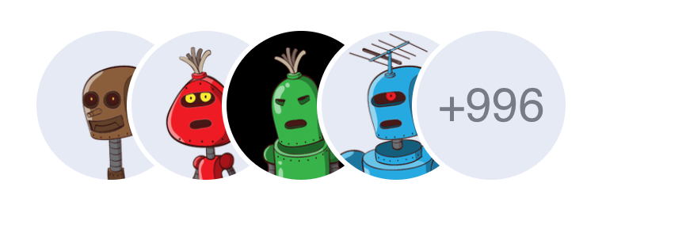

# Overview

Qodly Custom Component to display avatars by group

# Getting Started

## Properties:

| Prop | Type | Default | Description | Example |
| ---- | ---- | ------- | ----------- | ------- |
| width | string or number | `100px` | The width of the image. | `30px` |
| height | string or number | `100px` | The height of the image. | `30px` |
| marginRight | string | `-40px` | The user's rating. Number of stars to highlight. | `10px` |
| marginLeft | string | `0px` | The user's rating. Number of stars to highlight. | `10px` |
| borderWidth | string or number | `3px` | the width of the border | `2px` |
| borderColor | string | `white` | The color of the border | `#767B87, rgb(203, 211, 227), black` |
| borderStyle | string | `solid` | The style of the border  | `solid` |
| borderRadius | string | `50%` | The border raduis | `50%, 20px` |
| backgroundColor | string | `#E6EAF4` | The color of picture when no picture is displayed | `#E6EAF4, rgb(230, 67, 47), grey` |
| color | string | `#767B87` | The color of text when no picture is displayed | `#767B87, rgb(203, 211, 227), black ` |
| fontSize | string | `24px` | The font size of the text when no picture is displayed | `0` |

## How to install it

  Soon ...